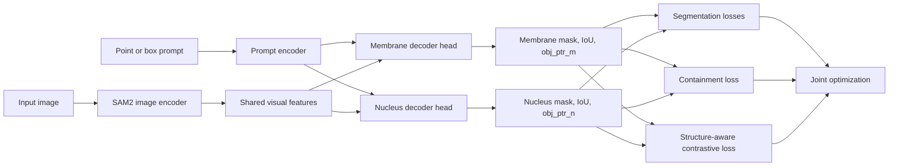

# TROP2 Structural-Prior SAM2

This repository adapts SAM 2.1 for paired membrane-nucleus segmentation on TROP2 cell images.
The project keeps the upstream SAM2 codebase for compatibility, but the training target here is a custom static-image cell segmentation task rather than generic promptable segmentation.

The current paper-oriented version adds a structure-prior learning framework on top of the SAM2 training stack:
- Dual-structure decoding for membrane and nucleus masks from the same prompted cell.
- Structure-aware contrastive alignment over object-level decoder pointers.
- Membrane-nucleus containment constraint to enforce biologically plausible predictions.

An alternative paper branch can also replace the contrastive module with a denser
hierarchical-region objective:
- Hierarchical region decomposition consistency over the membrane-minus-nucleus ring.

## Method Overview



## Project-Specific Changes

The main project-specific code lives in these files:
- [training/model/sam2.py](training/model/sam2.py)
  Keeps decoder object pointers during training so they can be used by the new structure-aware loss.
- [training/loss_fns.py](training/loss_fns.py)
  Adds `loss_struct_contrast`, `loss_contain`, and `loss_ring` on top of the original mask, dice, IoU, and object-score losses.
- [sam2/configs/sam2.1_training/sam2.1_hiera_b+_trop2_structural_priors.yaml](sam2/configs/sam2.1_training/sam2.1_hiera_b+_trop2_structural_priors.yaml)
  Main training configuration for the structural-prior variant used for paper experiments.
- [sam2/configs/sam2.1_training/sam2.1_hiera_b+_trop2_hierarchical_priors.yaml](sam2/configs/sam2.1_training/sam2.1_hiera_b+_trop2_hierarchical_priors.yaml)
  Alternative configuration that drops contrastive alignment and supervises the membrane-minus-nucleus ring region instead.

### Structural-Prior Framework

The current method can be summarized as:

1. Use a shared SAM2 image encoder and prompt encoder.
2. Decode two coupled structures for each prompted cell: membrane and nucleus.
3. Optimize standard segmentation losses for both structures.
4. Align membrane and nucleus object pointers from the same cell with a contrastive objective.
5. Penalize nucleus probability mass that falls outside the membrane prediction.

The total loss is:

`L = L_seg + lambda_ctr * L_struct_contrast + lambda_cont * L_contain`

Where:
- `L_seg` is the original SAM2-style segmentation objective.
- `L_struct_contrast` aligns membrane and nucleus embeddings for the same instance.
- `L_contain` enforces membrane-contains-nucleus structure consistency.

## Repository Layout

Important folders and entry points:

```text
sam2/                         Upstream SAM2 models, decoders, configs
training/                     Upstream SAM2 training framework plus project losses
training/model/sam2.py        Training-time model wrapper
training/loss_fns.py          Segmentation losses + structure-prior losses
sam2/configs/sam2.1_training/ Project training configs
infer.py                      Custom image inference entry point
tools/vos_inference.py        Upstream evaluation / inference utility
datasets/                     Local datasets (ignored by git)
checkpoints/                  Local checkpoints (ignored by git)
```

## Dataset Layout

The project expects a paired membrane-nucleus dataset following the directory structure already used by the configs:

```text
datasets/trop2/
  train/
    JPEGImages/
      sample_id/
        0000.png
    Annotations_mask_me/
      sample_id/
        0000.png
    Annotations_mask_nu/
      sample_id/
        0000.png
    jsons/
      sample_id/
        0000.json
  test/
    JPEGImages/
    Annotations_mask_me/
    Annotations_mask_nu/
    jsons/
```

Notes:
- Each sample is stored as a folder, even for static-image training.
- `Annotations_mask_me` is the membrane target.
- `Annotations_mask_nu` is the nucleus target.
- `jsons/` stores prompt annotations used by the custom inference and evaluation script.
- The structural-prior config treats this as `multitask_num: 2`.

## Environment Setup

This repository still follows the upstream SAM2 installation pattern:

```bash
pip install -e ".[dev]"
```

You also need:
- Python 3.10+
- PyTorch and TorchVision versions compatible with SAM2
- A SAM2.1 checkpoint, for example `sam2.1_hiera_base_plus.pt`, placed under `checkpoints/`

## Training

The recommended training entry point is the upstream launcher in [training/train.py](training/train.py), not the legacy top-level [train.py](train.py).

For ablation experiments, the launcher now supports direct CLI control of the two paper modules:
- `--ablation baseline`
- `--ablation contain`
- `--ablation contrast`
- `--ablation full`

It also supports explicit switches:
- `--with-contain`
- `--with-contrast`

Typical commands:

```bash
python training/train.py --config configs/sam2.1_training/sam2.1_hiera_b+_trop2_structural_priors.yaml --ablation baseline --use-cluster 0 --num-gpus 4
python training/train.py --config configs/sam2.1_training/sam2.1_hiera_b+_trop2_structural_priors.yaml --ablation contain --use-cluster 0 --num-gpus 4
python training/train.py --config configs/sam2.1_training/sam2.1_hiera_b+_trop2_structural_priors.yaml --ablation contrast --use-cluster 0 --num-gpus 4
python training/train.py --config configs/sam2.1_training/sam2.1_hiera_b+_trop2_structural_priors.yaml --ablation full --use-cluster 0 --num-gpus 4
```

For the replacement hierarchical-region idea, use the dedicated config and the new presets:

```bash
python training/train.py --config configs/sam2.1_training/sam2.1_hiera_b+_trop2_hierarchical_priors.yaml --ablation ring --use-cluster 0 --num-gpus 4
python training/train.py --config configs/sam2.1_training/sam2.1_hiera_b+_trop2_hierarchical_priors.yaml --ablation hierarchical_full --use-cluster 0 --num-gpus 4
```

If you prefer explicit switches instead of presets, these also work:

```bash
python training/train.py --with-contain --use-cluster 0 --num-gpus 4
python training/train.py --with-contrast --use-cluster 0 --num-gpus 4
python training/train.py --with-contain --with-contrast --use-cluster 0 --num-gpus 4
```

By default, ablation runs are written to:

```text
checkpoints/ablations/baseline/
checkpoints/ablations/contain/
checkpoints/ablations/contrast/
checkpoints/ablations/full/
```

You can override the save location with `--experiment-dir`, and you can still pass extra Hydra overrides with repeated `--hydra-override`.

## Inference

The custom inference script is [infer.py](infer.py).

### Single-image inference

Legacy named checkpoints still work:

```bash
python infer.py --img_path assets/0000.png --model bplus_menu --save_res
```

Useful model options already defined in that script include:
- `bplus_me` for membrane-only checkpoints
- `bplus_nu` for nucleus-only checkpoints
- `bplus_menu` for paired membrane-nucleus checkpoints

For single-image inference, the script reads prompts from a JSON file with the same stem as the image by default, and you can override it with `--prompt-json` if needed.

For ablation checkpoints, you can now infer directly by experiment mode:

```bash
python infer.py --img_path assets/0000.png --ablation baseline --save_res
python infer.py --img_path assets/0000.png --ablation contain --save_res
python infer.py --img_path assets/0000.png --ablation contrast --save_res
python infer.py --img_path assets/0000.png --ablation full --save_res
```

If needed, override the model file explicitly:

```bash
python infer.py --img_path assets/0000.png --ablation full --ckpt-path checkpoints/my_custom_run/checkpoints/checkpoint.pt --save_res
```

The same explicit module switches are also supported at inference time:

```bash
python infer.py --img_path assets/0000.png --with-contain --save_res
python infer.py --img_path assets/0000.png --with-contrast --save_res
python infer.py --img_path assets/0000.png --with-contain --with-contrast --save_res
```

### Metric evaluation

The same script also contains the batch evaluation entry used for quantitative testing.
When `--eval` is enabled, [infer.py](infer.py) scans the dataset folders, loads image-level prompts from `datasets/trop2/<mode>/jsons`, runs prediction for each structure, and prints mean metrics over the whole split.

Example:

```bash
python infer.py --eval --mode test --ablation full --save-metrics
```

Expected directory layout for evaluation:

```text
datasets/trop2/test/
  JPEGImages/
    sample_id/
      0000.png
  jsons/
    sample_id/
      0000.json
```

The evaluation loop is implemented by `main(args)` in [infer.py](infer.py), which repeatedly calls `evaluate(...)` and aggregates the returned tuple from [infer_utils.py](infer_utils.py):

```python
bdq_tmp, bsq_tmp, bpq_tmp, aji_score = cal_metric(...)
```

So the printed result dictionary reports, for each structure label:
- `bdq`: detection-quality term from the PQ decomposition
- `bsq`: segmentation-quality term from the PQ decomposition
- `bpq`: panoptic quality
- `aji`: aggregated Jaccard index

The exported structure labels are normalized to the English names `membrane` and `nucleus`.
Legacy Chinese annotation labels are still accepted when reading existing JSON prompt files.

When `--save-metrics` is enabled, evaluation also exports:

```text
analysis/eval/<experiment>_<split>_per_case.csv
analysis/eval/<experiment>_<split>_summary.json
```

These files are designed to feed directly into the plotting utilities under `tools/`.

A typical console output has this form, with dictionary keys taken from the labels defined for the selected model in [infer.py](infer.py):

```python
{
    "membrane": {
        "bdq": 0.81,
        "bsq": 0.84,
        "bpq": 0.68,
        "aji": 0.71,
    },
    "nucleus": {
        "bdq": 0.86,
        "bsq": 0.88,
        "bpq": 0.76,
        "aji": 0.79,
    }
}
```

If you want both qualitative outputs and quantitative evaluation, use:

```bash
python infer.py --img_path assets/0000.png --ablation full --save_res
python infer.py --eval --mode test --ablation full --save-metrics
```

## Visualization

The repository now includes reusable visualization tools for paper figures and error analysis.

### Quantitative plots

Use [tools/plot_eval_metrics.py](tools/plot_eval_metrics.py) on one or more exported per-case CSV files:

```bash
python tools/plot_eval_metrics.py --csv analysis/eval/baseline_test_per_case.csv --csv analysis/eval/full_test_per_case.csv --output-dir analysis/figures
```

This script generates:
- `metric_boxplots.png`
- `metric_heatmap.png`
- `metric_grouped_bars.png`
- `metric_ratio_chart.png`

These cover the boxplot, heatmap, comparison bar chart, and structure-ratio chart needs for ablation analysis.

What each figure means and how to read it:
- `metric_boxplots.png`: shows the per-case distribution of each metric for every experiment-label pair. Use it to judge stability, variance, and outliers. If one method has a higher median and a tighter box, it usually means the gain is not only better on average but also more robust across cases.
- `metric_heatmap.png`: shows the mean score of each metric for each experiment-label pair. Use it as the fastest global comparison view. It is useful for identifying which module improves membrane more, which improves nucleus more, and whether the full framework is consistently best across all metrics.
- `metric_grouped_bars.png`: shows side-by-side mean metric values for each structure label under different experiments. Use it for clean ablation claims in the paper, such as "containment mainly improves membrane structure consistency" or "contrastive alignment mainly benefits nucleus discrimination."
- `metric_ratio_chart.png`: shows the relative share of membrane and nucleus performance within each experiment for a given metric. It is useful for judging structural balance. If one method improves only one structure while hurting the other, that imbalance will be more obvious here than in a simple average score table.

How to use these plots in analysis:
- If `contain` mainly raises membrane `AJI` or `BPQ`, that supports the claim that the membrane-nucleus containment prior improves structural plausibility.
- If `contrast` mainly reduces boxplot spread or improves nucleus-related scores, that supports the claim that structure-aware contrastive learning improves instance discrimination and feature consistency.
- If `full` is best in both heatmap and grouped bars while also keeping balanced ratio charts, that supports the claim that the two modules are complementary rather than redundant.
- If one method has strong mean scores but wide boxplots, you can discuss it as effective but less stable; if it has both strong means and tight spreads, you can discuss it as both accurate and robust.

### Qualitative comparison grids

Use [tools/make_qualitative_grid.py](tools/make_qualitative_grid.py) to assemble side-by-side figure panels:

```bash
python tools/make_qualitative_grid.py --image assets/0000.png --image outputs/baseline_case.png --image outputs/full_case.png --title Raw --title Baseline --title Full --output analysis/figures/case_comparison.png
```

This is useful for making paper-ready comparison figures from raw images, overlay outputs, and different ablation variants.

What qualitative grids are good for:
- Boundary comparison: whether the predicted membrane contour is smoother, more complete, or less fragmented.
- Containment inspection: whether the nucleus prediction stays inside the membrane region more often.
- Small-object analysis: whether tiny nuclei or weak-boundary cells are recovered more reliably.
- Failure-case diagnosis: whether errors come from under-segmentation, over-segmentation, merged instances, or missed instances.

What conclusions you can usually support with qualitative figures:
- `contain` should be most visible in cases where the baseline predicts nuclei leaking outside the membrane.
- `contrast` should be most visible in crowded regions or difficult boundaries where neighboring cells are easily confused.
- `full` should ideally show both cleaner pairwise structure and more complete object separation, which matches the intended story of "feature alignment + structural prior."

## Paper Experiment Suggestions

For clean ablation studies, keep these variants separate:
- Baseline SAM2 fine-tuning
- Baseline + containment loss
- Baseline + structure-aware contrastive loss
- Full structural-prior framework

This makes it easier to justify the contribution of each module in the final paper.

## Notes On Repository Hygiene

This branch intentionally excludes local working artifacts such as:
- temporary previews
- PPT exports
- presentation-generation scripts
- scratch outputs under `temp/`

They are not part of the model, training, inference, or evaluation pipeline and are ignored to keep the repository focused on code that is actually required for the project.

## Upstream Origin

This project is built on top of Meta's SAM2 codebase.
The repository still contains much of the upstream structure so existing SAM2 utilities and configs continue to work, but the root README now documents the TROP2 project rather than the generic upstream release.
