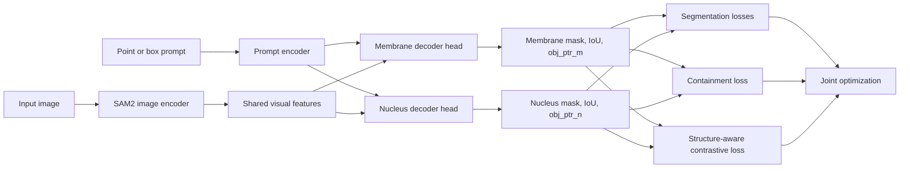

# TROP2 Structural-Prior SAM2

This repository adapts SAM 2.1 for paired membrane-nucleus segmentation on TROP2 cell images.
The project keeps the upstream SAM2 codebase for compatibility, but the training target here is a custom static-image cell segmentation task rather than generic promptable segmentation.

The current paper-oriented version adds a structure-prior learning framework on top of the SAM2 training stack:
- Dual-structure decoding for membrane and nucleus masks from the same prompted cell.
- Structure-aware contrastive alignment over object-level decoder pointers.
- Membrane-nucleus containment constraint to enforce biologically plausible predictions.

## Method Overview



## Project-Specific Changes

The main project-specific code lives in these files:
- [training/model/sam2.py](training/model/sam2.py)
  Keeps decoder object pointers during training so they can be used by the new structure-aware loss.
- [training/loss_fns.py](training/loss_fns.py)
  Adds `loss_struct_contrast` and `loss_contain` on top of the original mask, dice, IoU, and object-score losses.
- [sam2/configs/sam2.1_training/sam2.1_hiera_b+_trop2_structural_priors.yaml](sam2/configs/sam2.1_training/sam2.1_hiera_b+_trop2_structural_priors.yaml)
  Main training configuration for the structural-prior variant used for paper experiments.

### Structural-Prior Framework

The current method can be summarized as:

1. Use a shared SAM2 image encoder and prompt encoder.
2. Decode two coupled structures for each prompted cell: membrane and nucleus.
3. Optimize standard segmentation losses for both structures.
4. Align membrane and nucleus object pointers from the same cell with a contrastive objective.
5. Penalize nucleus probability mass that falls outside the membrane prediction.

The total loss is:

`L = L_seg + lambda_ctr * L_struct_contrast + lambda_cont * L_contain`

Where:
- `L_seg` is the original SAM2-style segmentation objective.
- `L_struct_contrast` aligns membrane and nucleus embeddings for the same instance.
- `L_contain` enforces membrane-contains-nucleus structure consistency.

## Repository Layout

Important folders and entry points:

```text
sam2/                         Upstream SAM2 models, decoders, configs
training/                     Upstream SAM2 training framework plus project losses
training/model/sam2.py        Training-time model wrapper
training/loss_fns.py          Segmentation losses + structure-prior losses
sam2/configs/sam2.1_training/ Project training configs
infer.py                      Custom image inference entry point
tools/vos_inference.py        Upstream evaluation / inference utility
datasets/                     Local datasets (ignored by git)
checkpoints/                  Local checkpoints (ignored by git)
```

## Dataset Layout

The project expects a paired membrane-nucleus dataset following the directory structure already used by the configs:

```text
datasets/trop2/
  train/
    JPEGImages/
      sample_id/
        0000.png
    Annotations_mask_me/
      sample_id/
        0000.png
    Annotations_mask_nu/
      sample_id/
        0000.png
    jsons/
      sample_id/
        0000.json
  test/
    JPEGImages/
    Annotations_mask_me/
    Annotations_mask_nu/
    jsons/
```

Notes:
- Each sample is stored as a folder, even for static-image training.
- `Annotations_mask_me` is the membrane target.
- `Annotations_mask_nu` is the nucleus target.
- `jsons/` stores prompt annotations used by the custom inference and evaluation script.
- The structural-prior config treats this as `multitask_num: 2`.

## Environment Setup

This repository still follows the upstream SAM2 installation pattern:

```bash
pip install -e ".[dev]"
```

You also need:
- Python 3.10+
- PyTorch and TorchVision versions compatible with SAM2
- A SAM2.1 checkpoint, for example `sam2.1_hiera_base_plus.pt`, placed under `checkpoints/`

## Training

The recommended training entry point is the upstream launcher in [training/train.py](training/train.py), not the legacy top-level [train.py](train.py).

Run the structural-prior version with:

```bash
python training/train.py -c configs/sam2.1_training/sam2.1_hiera_b+_trop2_structural_priors.yaml --use-cluster 0 --num-gpus 4
```

Key settings in the structural-prior config:
- `multitask_num: 2`
- `num_maskmem: 0`
- `multimask_output_in_sam: false`
- `multimask_output_for_tracking: false`
- `return_obj_ptr_for_loss: true`
- `loss_struct_contrast: 0.2`
- `loss_contain: 1.0`

## Inference

The custom inference script is [infer.py](infer.py).

### Single-image inference

Example:

```bash
python infer.py --img_path assets/0000.png --model bplus_menu --save_res
```

Useful model options already defined in that script include:
- `bplus_me` for membrane-only checkpoints
- `bplus_nu` for nucleus-only checkpoints
- `bplus_menu` for paired membrane-nucleus checkpoints

### Metric evaluation

The same script also contains the batch evaluation entry used for quantitative testing.
When `--eval` is enabled, [infer.py](infer.py) scans the dataset folders, loads image-level prompts from `datasets/trop2/<mode>/jsons`, runs prediction for each structure, and prints mean metrics over the whole split.

Example:

```bash
python infer.py --eval --mode test --model bplus_menu
```

Expected directory layout for evaluation:

```text
datasets/trop2/test/
  JPEGImages/
    sample_id/
      0000.png
  jsons/
    sample_id/
      0000.json
```

The evaluation loop is implemented by `main(args)` in [infer.py](infer.py), which repeatedly calls `evaluate(...)` and aggregates the returned tuple from [infer_utils.py](infer_utils.py):

```python
bdq_tmp, bsq_tmp, bpq_tmp, aji_score = cal_metric(...)
```

So the printed result dictionary reports, for each structure label:
- `bdq`: detection-quality term from the PQ decomposition
- `bsq`: segmentation-quality term from the PQ decomposition
- `bpq`: panoptic quality
- `aji`: aggregated Jaccard index

A typical console output has this form, with dictionary keys taken from the labels defined for the selected model in [infer.py](infer.py):

```python
{
    "membrane": [bdq, bsq, bpq, aji],
    "nucleus": [bdq, bsq, bpq, aji]
}
```

If you want both qualitative outputs and quantitative evaluation, use:

```bash
python infer.py --img_path assets/0000.png --model bplus_menu --save_res
python infer.py --eval --mode test --model bplus_menu
```

## Paper Experiment Suggestions

For clean ablation studies, keep these variants separate:
- Baseline SAM2 fine-tuning
- Baseline + containment loss
- Baseline + structure-aware contrastive loss
- Full structural-prior framework

This makes it easier to justify the contribution of each module in the final paper.

## Notes On Repository Hygiene

This branch intentionally excludes local working artifacts such as:
- temporary previews
- PPT exports
- presentation-generation scripts
- scratch outputs under `temp/`

They are not part of the model, training, inference, or evaluation pipeline and are ignored to keep the repository focused on code that is actually required for the project.

## Upstream Origin

This project is built on top of Meta's SAM2 codebase.
The repository still contains much of the upstream structure so existing SAM2 utilities and configs continue to work, but the root README now documents the TROP2 project rather than the generic upstream release.
