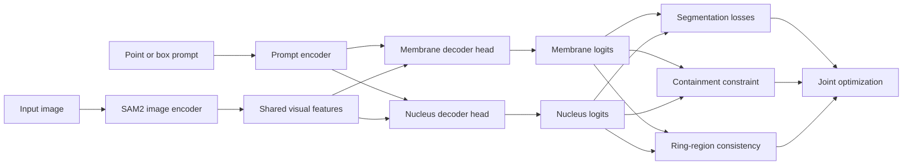

# TROP2 Hierarchical-Prior SAM2

This repository adapts SAM 2.1 for paired membrane-nucleus segmentation on TROP2 cell images.
The upstream SAM2 codebase is kept for compatibility, while this branch focuses on a static-image
cell segmentation setting with paired membrane and nucleus supervision.

The current paper-facing method on this branch is:

- `Structure-Prior Enhanced SAM2 with Hierarchical Region Consistency`

It contains two core modules:

- `Hierarchical Region Decomposition Consistency`
- `Membrane-Nucleus Containment Constraint`

## Method Overview



## Core Idea

This branch no longer treats contrastive alignment as the main innovation.
Instead, it exploits the paired membrane-nucleus annotations more directly.

The current method is based on two priors:

1. `Containment prior`
   The nucleus should stay inside the membrane region.
2. `Hierarchical region prior`
   The membrane and nucleus jointly define a meaningful ring region:
   `ring = membrane - nucleus`

The ring target is built directly from paired annotations:

- `Y_ring = Y_membrane - Y_nucleus`

The predicted ring probability is derived from the two decoder outputs:

- `P_ring = sigmoid(P_membrane) * (1 - sigmoid(P_nucleus))`

The total objective on this branch is:

- `L = L_seg + lambda_cont * L_contain + lambda_ring * L_ring`

Where:

- `L_seg` is the original SAM2-style segmentation objective
- `L_contain` penalizes nucleus probability mass outside the membrane
- `L_ring` supervises the membrane-minus-nucleus ring with BCE + Dice

## Project-Specific Files

The main project-specific code for this branch lives in:

- [training/loss_fns.py](training/loss_fns.py)
  Adds `loss_contain` and `loss_ring`
- [training/trainer.py](training/trainer.py)
  Moves the loss module onto the training device so custom loss heads work correctly
- [training/utils/experiment_utils.py](training/utils/experiment_utils.py)
  Defines ablation presets including `baseline`, `contain`, `ring`, and `hierarchical_full`
- [sam2/configs/sam2.1_training/sam2.1_hiera_b+_trop2_hierarchical_priors.yaml](sam2/configs/sam2.1_training/sam2.1_hiera_b+_trop2_hierarchical_priors.yaml)
  Main training config for the hierarchical-region branch
- [analysis/hierarchical_region_consistency.md](analysis/hierarchical_region_consistency.md)
  Short branch-specific experiment notes and recommended commands

## Repository Layout

Important folders and entry points:

```text
sam2/                         Upstream SAM2 models, decoders, configs
training/                     Upstream SAM2 training framework plus project losses
training/model/sam2.py        Training-time model wrapper
training/loss_fns.py          Segmentation losses + hierarchical structural priors
sam2/configs/sam2.1_training/ Project training configs
infer.py                      Custom image inference entry point
tools/plot_eval_metrics.py    Quantitative plotting utility
datasets/                     Local datasets (ignored by git)
checkpoints/                  Local checkpoints (ignored by git)
analysis/                     Experiment summaries, CSVs, and figures
```

## Dataset Layout

The project expects a paired membrane-nucleus dataset with this structure:

```text
datasets/trop2/
  train/
    JPEGImages/
      sample_id/
        0000.png
    Annotations_mask_me/
      sample_id/
        0000.png
    Annotations_mask_nu/
      sample_id/
        0000.png
    jsons/
      sample_id/
        0000.json
  test/
    JPEGImages/
    Annotations_mask_me/
    Annotations_mask_nu/
    jsons/
```

Notes:

- `Annotations_mask_me` is the membrane target
- `Annotations_mask_nu` is the nucleus target
- `jsons/` stores prompt annotations used by the custom inference and evaluation script
- Each static image is still stored under a sample folder for compatibility with the SAM2 training pipeline

## Environment Setup

Install the repository in editable mode:

```bash
pip install -e ".[dev]"
```

You also need:

- Python 3.10+
- PyTorch and TorchVision versions compatible with SAM2
- A SAM2.1 checkpoint such as `sam2.1_hiera_base_plus.pt`

Place the checkpoint under:

```text
checkpoints/sam2.1_hiera_base_plus.pt
```

## Training

Use the upstream launcher at [training/train.py](training/train.py).

### Main branch experiments

This branch supports these main presets:

- `baseline`
- `contain`
- `ring`
- `hierarchical_full`

Recommended commands:

```bash
python training/train.py --config configs/sam2.1_training/sam2.1_hiera_b+_trop2_hierarchical_priors.yaml --ablation baseline --use-cluster 0 --num-gpus 1
python training/train.py --config configs/sam2.1_training/sam2.1_hiera_b+_trop2_hierarchical_priors.yaml --ablation contain --use-cluster 0 --num-gpus 1
python training/train.py --config configs/sam2.1_training/sam2.1_hiera_b+_trop2_hierarchical_priors.yaml --ablation ring --use-cluster 0 --num-gpus 1
python training/train.py --config configs/sam2.1_training/sam2.1_hiera_b+_trop2_hierarchical_priors.yaml --ablation hierarchical_full --use-cluster 0 --num-gpus 1
```

Default branch weights:

- `loss_contain = 1.0`
- `loss_ring = 0.5`
- `loss_struct_contrast = 0.0`

By default, ablation runs are written to:

```text
checkpoints/ablations/baseline/
checkpoints/ablations/contain/
checkpoints/ablations/ring/
checkpoints/ablations/hierarchical_full/
```

You can still override any value with repeated `--hydra-override`.

## Inference

The custom inference entry point is [infer.py](infer.py).

### Single-image inference

Example:

```bash
python infer.py --img_path assets/0000.png --model bplus_menu --save_res
```

Useful built-in model options:

- `bplus_me` for membrane-only checkpoints
- `bplus_nu` for nucleus-only checkpoints
- `bplus_menu` for paired membrane-nucleus checkpoints

For ablation checkpoints on this branch:

```bash
python infer.py --img_path assets/0000.png --ablation baseline --save_res
python infer.py --img_path assets/0000.png --ablation contain --save_res
python infer.py --img_path assets/0000.png --ablation ring --save_res
python infer.py --img_path assets/0000.png --ablation hierarchical_full --save_res
```

If needed, override the checkpoint explicitly:

```bash
python infer.py --img_path assets/0000.png --ablation hierarchical_full --ckpt-path checkpoints/my_custom_run/checkpoints/checkpoint.pt --save_res
```

### Metric evaluation

Batch evaluation uses the same script:

```bash
python infer.py --eval --mode test --ablation hierarchical_full --save-metrics
```

Expected structure:

```text
datasets/trop2/test/
  JPEGImages/
    sample_id/
      0000.png
  jsons/
    sample_id/
      0000.json
```

The exported summary reports:

- `bdq`
- `bsq`
- `bpq`
- `aji`

Exported labels are normalized to English:

- `membrane`
- `nucleus`

Legacy Chinese annotation labels are still accepted when reading prompt JSON files.

With `--save-metrics`, inference exports:

```text
analysis/eval/<experiment>_<split>_per_case.csv
analysis/eval/<experiment>_<split>_summary.json
```

## Visualization

Use [tools/plot_eval_metrics.py](tools/plot_eval_metrics.py) on one or more per-case CSV files:

```bash
python tools/plot_eval_metrics.py --csv analysis/eval/baseline_test_per_case.csv --csv analysis/eval/hierarchical_full_test_per_case.csv --output-dir analysis/figures
```

The plotting utility generates:

- `metric_boxplots.png`
- `metric_heatmap.png`
- `metric_grouped_bars.png`
- `metric_ratio_chart.png`

How to read them on this branch:

- `metric_boxplots.png`
  Use it to judge stability and outliers across cases
- `metric_heatmap.png`
  Use it for the fastest comparison of mean scores across experiments and structures
- `metric_grouped_bars.png`
  Use it to compare membrane and nucleus metrics side by side
- `metric_ratio_chart.png`
  Use it to check whether gains are balanced or structure-specific

## Recommended Ablation Order

For this branch, the most useful ablation table is:

- Baseline SAM2 fine-tuning
- Baseline + containment loss
- Baseline + ring consistency
- Baseline + containment + ring consistency

This matches the current branch design and is the cleanest paper story.

## Notes On Repository Hygiene

This branch intentionally excludes local-only artifacts such as:

- weight files
- temporary previews
- scratch outputs under `temp/`
- presentation exports

Weights are expected to be managed outside the repo, for example through local storage or Hugging Face.

## Upstream Origin

This project is built on top of Meta's SAM2 codebase.
The repository still preserves most of the upstream structure so existing SAM2 utilities and configs continue to work,
but the root README is rewritten here for the TROP2 paired membrane-nucleus project.
